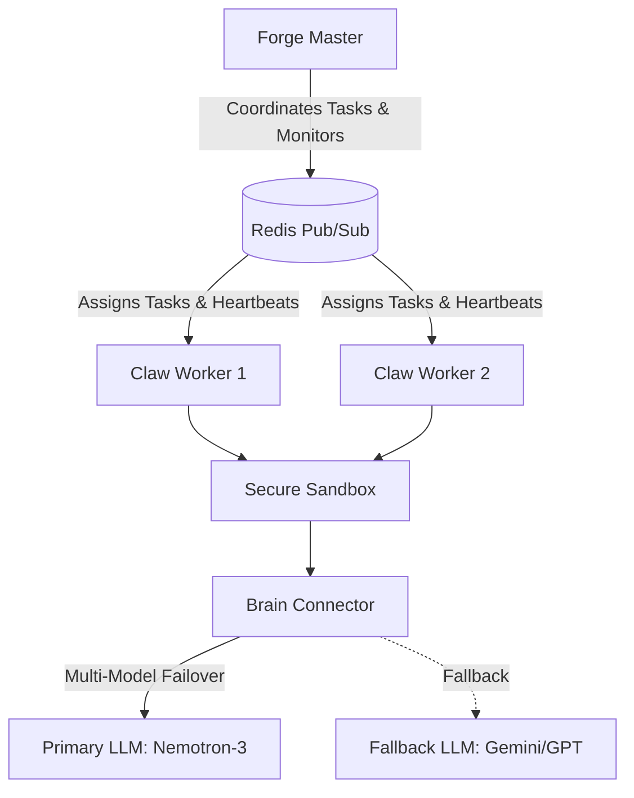

# NemoClaw-Forge

A distributed AI Agent orchestration engine built for high-performance asynchronous execution.

## Architecture



## Features
- **Multi-Model Failover**: Automatically falls back to secondary models if primary fails.
- **Secure Sandbox**: Execution wrapper for bounded task time and resource limits.
- **Real-time Monitoring**: Redis-backed async pub/sub for agent communication.

## Quickstart

```bash
pip install -e .
nemoclaw forge start
nemoclaw claw start --id worker-1
```
