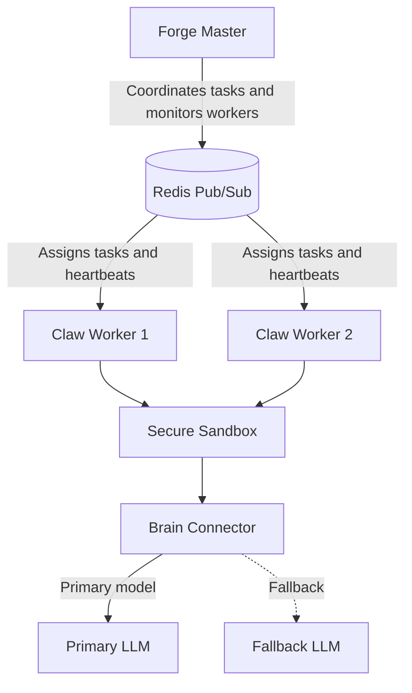

# NemoClaw-Forge

A distributed AI agent orchestration engine for asynchronous task execution,
worker coordination, and multi-model failover.

## What It Does

NemoClaw-Forge provides a lightweight control plane for coordinating agent
workers through Redis pub/sub. It is designed for experiments and internal
tools that need resilient task dispatch, model fallback, sandboxed execution,
and simple operational visibility.

## Architecture


```mermaid
graph TD
    Forge[Forge Master]
    RedisPubSub[(Redis Pub/Sub)]
    Claw1[Claw Worker 1]
    Claw2[Claw Worker 2]
    Brain[Brain Connector]
    Sandbox[Secure Sandbox]

    Forge -- Coordinates tasks and monitors workers --> RedisPubSub
    RedisPubSub -- Assigns tasks and heartbeats --> Claw1
    RedisPubSub -- Assigns tasks and heartbeats --> Claw2

    Claw1 --> Sandbox
    Claw2 --> Sandbox

    Sandbox --> Brain
    Brain -- Primary model --> LLM_Primary[Primary LLM]
    Brain -. Fallback .-> LLM_Fallback[Fallback LLM]
```

## Features

- **Worker orchestration**: Redis-backed task dispatch and heartbeat tracking.
- **Multi-model failover**: fallback routing when the primary model fails.
- **Sandboxed execution**: bounded task runtime and resource controls.
- **Scout workflow**: scheduled GitHub and Upwork intelligence reports.
- **Ledger dashboard**: small web UI for expense tracking experiments.

## Quick Start

```bash
python -m venv .venv
source .venv/bin/activate
pip install -e .

nemoclaw forge start
nemoclaw claw start --id worker-1
```

On Windows PowerShell:

```powershell
py -m venv .venv
.\.venv\Scripts\Activate.ps1
pip install -e .
```

## Configuration

Create a local `.env` file for secrets and machine-specific settings:

```bash
GITHUB_TOKEN=your_github_token
REPORT_TARGET=discord_or_message_target
OPENCLAW_GATEWAY_URL=ws://127.0.0.1:18789
OPENCLAW_GATEWAY_TOKEN=your_gateway_token
```

Do not commit `.env`, local databases, generated reports, coverage files, or
virtual environments.

## Scout Report

```bash
PYTHON_BIN=.venv/bin/python3 ./scout_and_report.sh
```

The script writes generated reports to `reports/`, which is intentionally
ignored by Git.

## Repository Hygiene

Generated artifacts such as `venv/`, `.coverage`, `*.db`, `__pycache__/`, and
scheduled report outputs are excluded from version control. This keeps the
repository focused on source code and documentation.
